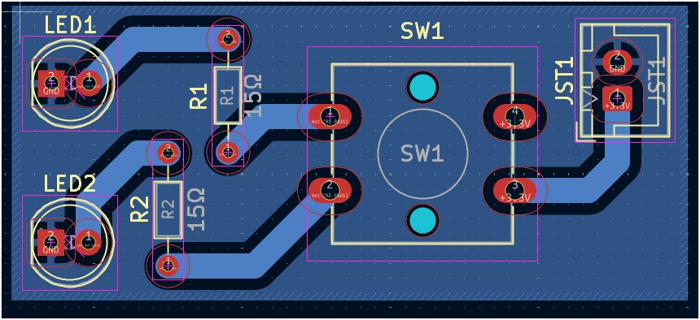
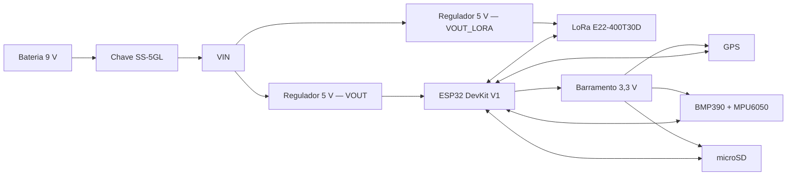

# Placa de Iluminação Weiss

Placa de acionamento de iluminação desenvolvida em **KiCad**, responsável por controlar dois LEDs com o objetivo de iluminar a parte interna do weiss através de uma chave (push-button), a partir de uma alimentação externa de **3.3V**. O projeto foi desenhado para ser simples e robusto, priorizando facilidade de montagem (todos os componentes em THT) e baixo custo.

## Visão geral do circuito

O circuito é alimentado externamente via um conector **JST XH de 2 vias**, que entrega +3.3V e GND à placa. Essa alimentação passa por um **push-button (SW1)**, que atua como chave liga/desliga geral do circuito. A partir do botão, a alimentação se divide em **dois ramos em paralelo**, cada um composto por um resistor limitador de corrente em série com um LED de alta potência:




Ou seja: quando o botão é pressionado (ou travado, dependendo do tipo de chave utilizada), o circuito fecha e os dois LEDs acendem simultaneamente. Cada LED possui seu próprio resistor, de forma que o brilho e a corrente de cada um são definidos de forma independente — isso evita que uma eventual diferença entre os dois LEDs (tensão direta, tolerância) afete o outro ramo, como aconteceria se estivessem em paralelo direto sob um único resistor.

Foram incluídas **PWR_FLAGs** no esquemático em +3.3V e GND. Elas não fazem parte do circuito fisicamente: servem apenas para informar ao ERC (Electrical Rules Checker) do KiCad que esses nós de alimentação são supridos por uma fonte externa (o JST), evitando falsos positivos de "net não alimentada".

## Componentes

| Referência | Componente | Footprint / Símbolo | Função |
|---|---|---|---|
| **JST1** | Conector JST XH 2 vias | `Connector_JST:JST_XH_B2B-XH-A_1x02_P2.50mm_Vertical` | Entrada de alimentação externa (+3.3V e GND) |
| **SW1** | Push-button | `Button_Switch_SMD:SW_SPST_B3S-1000` (footprint na placa: `SW_SPST_Omron_B3F-40xx-CRD`) | Chave de acionamento (liga/desliga) do circuito |
| **R1** | Resistor 15Ω | `Resistor_THT:R_Axial_DIN0204_L3.6mm_D1.6mm_P7.62mm_Horizontal` | Limitador de corrente do LED U1 |
| **R2** | Resistor 15Ω | `Resistor_THT:R_Axial_DIN0204_L3.6mm_D1.6mm_P7.62mm_Horizontal` | Limitador de corrente do LED U2 |
| **U1** | LED de alta potência | `LED_THT:LED_D5.0mm` | Iluminação (ramo 1) |
| **U2** | LED de alta potência | `LED_THT:LED_D5.0mm` | Iluminação (ramo 2) |

> Os símbolos `JST_basic`, `Push_button_4_pin` e `Led_High` são customizados e estão definidos na biblioteca local `CRD_KICAD.kicad_sym`, criada para padronizar os componentes usados nos projetos da Cactus Rockets.

## Funcionamento

O funcionamento da placa é puramente analógico/passivo — não há microcontrolador ou lógica embarcada:

1. A alimentação de +3.3V chega pelo conector **JST1**.
2. O **SW1** atua como interruptor: enquanto estiver fechado, a corrente flui para os dois ramos de LED.
3. Cada ramo (R + LED) limita a corrente que passa pelo respectivo LED, garantindo que ele opere dentro da faixa segura especificada pelo fabricante, evitando queima por excesso de corrente.
4. O retorno de ambos os ramos é feito para o **GND** comum da placa, que fecha o circuito de volta à fonte externa.

Por não haver controle ativo (PWM, microcontrolador, etc.), o brilho dos LEDs é fixo e definido unicamente pelo valor dos resistores e pela tensão de alimentação — não há dimerização nem controle remoto nesta versão da placa.

## Cálculo dos resistores limitadores

O valor do resistor limitador é definido pela equação pela lei de ohm:

```
R = (V_fonte - V_LED) / I_LED
```

Com `V_fonte = 3.3V` e `R = 15Ω`, a corrente em cada ramo depende da tensão direta (V_f) do LED utilizado. Por exemplo:

- Para um LED com V_f ≈ 2.0V → I ≈ (3.3 − 2.0) / 15 ≈ **87 mA**
- Para um LED com V_f ≈ 3.0V → I ≈ (3.3 − 3.0) / 15 ≈ **20 mA**

## Placa (PCB)

- Placa de **1.6mm** de espessura (FR4 padrão), com contorno definido em `Edge.Cuts`.
- Todos os componentes são **THT** (through-hole), facilitando a montagem manual e a soldagem.
- Footprints utilizados:
  - `CRD_Footprints:SW_SPST_Omron_B3F-40xx-CRD` (SW1)
  - `LED_THT:LED_D5.0mm` / `CRD_Footprints:LED_D5.0mm-CRD` (U1, U2)
  - `Resistor_THT:R_Axial_DIN0204_L3.6mm_D1.6mm_P7.62mm_Horizontal` (R1, R2)
  - `Connector_JST:JST_XH_B2B-XH-A_1x02_P2.50mm_Vertical` (JST1)

## Arquivos do projeto

| Arquivo | Descrição |
|---|---|
| `Placa_de_Iluminação_Weiss.kicad_sch` | Esquemático elétrico da placa |
| `Placa_de_Iluminação_Weiss.kicad_pcb` | Layout da placa (PCB) |
| `Placa_de_Iluminação_Weiss.kicad_pro` | Arquivo de projeto do KiCad |
| `CRD_KICAD.kicad_sym` | Biblioteca de símbolos customizados da Cactus Rockets |
| `fp-lib-table` | Tabela de bibliotecas de footprints usadas no projeto |

# Placa de Processamento — Weiss

Placa eletrônica central do projeto **Weiss**, desenvolvida em **KiCad**, responsável por concentrar o processamento, a aquisição de dados, o armazenamento local e as interfaces de telemetria e sinalização do sistema.

O projeto utiliza um **ESP32 DevKit V1** como controlador principal e integra módulos de rádio LoRa, GPS, cartão microSD, barômetro, unidade inercial, buzzer, LED de status e conectores para sinais externos.

> **Atenção:** esta documentação foi levantada a partir do esquemático e do layout da placa. Antes da fabricação ou da integração ao veículo, execute ERC/DRC no KiCad e confira a pinagem com o firmware e com os módulos físicos utilizados.

## Visão geral


Principais recursos:

- ESP32 DevKit V1 como unidade de processamento;
- telemetria por módulo LoRa **E22-400T30D**;
- posicionamento por módulo GPS serial;
- registro de dados em cartão microSD via SPI;
- medição de pressão e altitude com **BMP390** via I²C;
- medição inercial com **MPU6050** via I²C;
- buzzer e LED para sinalização local;
- duas entradas provenientes de optoacopladores externos;
- duas linhas de interface identificadas como `SKIB1` e `SKIB2`;
- alimentação por bateria de 9 V, com chave e duas linhas reguladas de 5 V;
- conectores JST de 2 vias para alimentação e sinais auxiliares.

## Arquitetura elétrica



A chave `U$12` conecta o terminal comum `VIN` ao contato associado a `V_BATTERY`; o outro contato da chave aparece sem conexão no esquemático. A partir de `VIN`, dois reguladores independentes, ambos identificados como **5 V**, geram:

- `VOUT`: alimentação do pino `VIN` do ESP32 DevKit V1;
- `VOUT_LORA`: alimentação dedicada do módulo LoRa.

O barramento de **3,3 V** é distribuído a partir do pino `3V3` do ESP32 para os sensores, GPS, microSD e conectores auxiliares. Todos os subsistemas da placa compartilham o mesmo GND.

## Mapeamento de pinos do ESP32

| GPIO | Rede | Interface / função |
|---:|---|---|
| 2 | `LED1` | LED de status |
| 4 | `TX1` | TX do ESP32 para RX do GPS |
| 5 | `CS` | Chip Select do microSD |
| 12 | `SKIB2` | Linha externa SKIB2 |
| 13 | `SKIB1` | Linha externa SKIB1 |
| 14 | `BUZZER` | Acionamento do buzzer |
| 15 | `RX1` | RX do ESP32 vindo do TX do GPS |
| 16 | `RX2` | RX do ESP32 vindo do TXD do LoRa |
| 17 | `TX2` | TX do ESP32 para RXD do LoRa |
| 18 | `CLK` | Clock SPI do microSD |
| 19 | `MISO` | Dados SPI do microSD para o ESP32 |
| 21 | `SDA` | Dados do barramento I²C |
| 22 | `SCL` | Clock do barramento I²C |
| 23 | `MOSI` | Dados SPI do ESP32 para o microSD |
| 32 | `M1` | Seleção de modo do LoRa |
| 33 | `M0` | Seleção de modo do LoRa |
| 34 | `OPTOACOPLADOR2` | Entrada externa isolada |
| 35 | `OPTOACOPLADOR1` | Entrada externa isolada |

> Os GPIOs 34 e 35 do ESP32 são somente de entrada. As linhas `SKIB1` e `SKIB2` chegam diretamente ao ESP32 no esquema apresentado; elas são sinais lógicos e **não devem acionar cargas pirotécnicas diretamente**. Qualquer carga desse tipo exige estágio externo de potência, intertravamentos e isolamento apropriados.

## Interfaces dos módulos

### LoRa E22-400T30D

| Pino do módulo | Rede da placa | Destino |
|---|---|---|
| `VCC` | `VOUT_LORA` | Alimentação dedicada de 5 V |
| `GND` | `GND` | Referência comum |
| `TXD` | `RX2` | GPIO16 do ESP32 |
| `RXD` | `TX2` | GPIO17 do ESP32 |
| `M0` | `M0` | GPIO33 do ESP32 |
| `M1` | `M1` | GPIO32 do ESP32 |
| `AUX` | Sem conexão | Reservado no layout atual |

### GPS

| Pino do módulo | Rede da placa | Destino |
|---|---|---|
| `VCC` | `3V3` | Alimentação de 3,3 V |
| `GND` | `GND` | Referência comum |
| `RX` | `TX1` | GPIO4 do ESP32 |
| `TX` | `RX1` | GPIO15 do ESP32 |

### BMP390 e MPU6050

Os dois sensores compartilham o barramento I²C:

| Sinal | GPIO do ESP32 | Módulos |
|---|---:|---|
| `SDA` | 21 | BMP390 e MPU6050 |
| `SCL` | 22 | BMP390 e MPU6050 |
| `3V3` | — | Alimentação |
| `GND` | — | Referência comum |

No layout atual, os pinos auxiliares `CS`, `SDO` e `INT` do BMP390 e `XDA`, `XCL`, `ADO` e `INT` do MPU6050 não são utilizados.

### Cartão microSD

| Sinal | GPIO do ESP32 |
|---|---:|
| `CS` | 5 |
| `CLK` | 18 |
| `MISO` | 19 |
| `MOSI` | 23 |
| `VCC` | 3,3 V |
| `GND` | GND |

## Conectores auxiliares

| Referência | Identificação | Pino 1 | Pino 2 |
|---|---|---|---|
| `U$10` | Bateria 9 V | `V_BATTERY` | `GND` |
| `U$6` | Skibs | `SKIB1` | `SKIB2` |
| `U$7` | Optoacopladores | `OPTOACOPLADOR1` | `OPTOACOPLADOR2` |
| `U$4` | Buzzer / 3,3 V | `BUZZER` | `3V3` |
| `U$5` | GND / 3,3 V | `3V3` | `GND` |

## Componentes principais

| Referência | Componente | Função |
|---|---|---|
| `U$11` | ESP32 DevKit V1 | Processamento e controle das interfaces |
| `U$2` | E22-400T30D | Comunicação LoRa |
| `U$3` | GPS Module | Posicionamento e referência de tempo |
| `U$1` | BMP390 | Pressão atmosférica e altitude |
| `U$9` | MPU6050 | Acelerômetro e giroscópio |
| `U$8` | MicroSD Small Reader | Armazenamento local de dados |
| `IC1` | Regulador 5 V | Alimentação `VOUT` do ESP32 |
| `IC2` | Regulador 5 V | Alimentação `VOUT_LORA` |
| `U$12` | Chave SS-5GL | Comutação da alimentação de entrada |
| `SP1` | AL60P | Buzzer |
| `LED1` | LED vermelho 5 mm | Indicação visual |
| `R1` | 220 Ω | Limitação de corrente do LED |
| `R2` | 46 Ω | Componente auxiliar; o pad 2 está sem conexão funcional no layout atual |
| `U$4` a `U$7`, `U$10` | JST 2,54 mm, 2 vias | Alimentação e sinais externos |

## Dimensões e construção da PCB

- dimensões aproximadas do contorno: **150 × 80 mm**;
- espessura configurada: **1,6 mm**;
- placa de duas camadas de cobre (`F.Cu` e `B.Cu`);
- componentes predominantemente THT e módulos montados por barras de pinos;
- planos de cobre e trilhas de alimentação de maior largura;
- footprints personalizados disponíveis na biblioteca local `Weiss.pretty`.

## Arquivos do projeto

| Caminho | Descrição |
|---|---|
| `Esquema.kicad_pro` | Projeto principal do KiCad |
| `Esquema.kicad_sch` | Esquemático elétrico |
| `Esquema.kicad_pcb` | Layout da PCB |
| `Esquema.svg` | Exportação vetorial do esquemático |
| `Esquema.kicad_dru` | Regras personalizadas da placa |
| `Weiss.pretty/` | Biblioteca local de footprints |
| `BibliotecasCRD-KiCad-main/` | Bibliotecas auxiliares utilizadas pelo projeto |
| `fp-lib-table` | Tabela de bibliotecas de footprints |
| `sym-lib-table` | Tabela de bibliotecas de símbolos |
